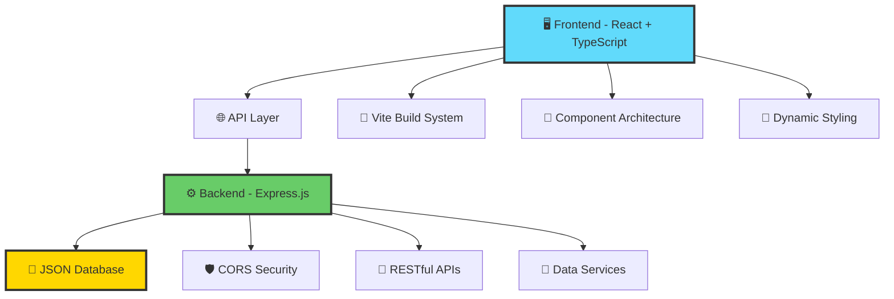

<div align="center">

# 💰✨ **EXPENSE TRACKER** ✨💰

### _A Next-Generation Financial Management Experience_

```
        ███████╗██╗  ██╗██████╗ ███████╗███╗   ██╗███████╗███████╗
        ██╔════╝╚██╗██╔╝██╔══██╗██╔════╝████╗  ██║██╔════╝██╔════╝
        █████╗   ╚███╔╝ ██████╔╝█████╗  ██╔██╗ ██║███████╗█████╗
        ██╔══╝   ██╔██╗ ██╔═══╝ ██╔══╝  ██║╚██╗██║╚════██║██╔══╝
        ███████╗██╔╝ ██╗██║     ███████╗██║ ╚████║███████║███████╗
        ╚══════╝╚═╝  ╚═╝╚═╝     ╚══════╝╚═╝  ╚═══╝╚══════╝╚══════╝
```

[](https://www.typescriptlang.org/)
[](https://reactjs.org/)
[](https://nodejs.org/)
[](https://expressjs.com/)
[](https://vitejs.dev/)

_🚀 Powered by cutting-edge technology stack_

</div>

---

## 🌟 **OVERVIEW**

Welcome to the **ultimate expense tracking experience** - a sleek, modern, and intuitive application that revolutionizes how you manage shared expenses. Built with the latest technologies and designed with user experience at its core, this application brings financial management into the future.

### 🎯 **Core Philosophy**

> _"Simplicity meets sophistication - where every transaction tells a story, and every expense becomes an insight."_

---

## ✨ **FEATURES**

<table>
<tr>
<td width="50%">

### 🎨 **Visual Excellence**

- **Dynamic Color System** - AI-powered color assignment for each payer
- **Gradient-Rich UI** - Beautiful, modern interface design
- **Responsive Design** - Seamless experience across all devices
- **Micro-Interactions** - Smooth animations and hover effects

</td>
<td width="50%">

### ⚡ **Performance & Functionality**

- **Real-time Updates** - Instant expense tracking
- **Smart Sorting** - Multiple sorting algorithms
- **Random Expense Generator** - Quick testing capabilities
- **One-Click Reset** - Instant data restoration

</td>
</tr>
</table>

### 🔮 **Advanced Capabilities**

```
🌈 Color-Coded Payers    │ 🔄 Smart Data Management   │ 📱 Mobile-First Design
🎲 Random Data Generation │ ⚡ Lightning-Fast Loading   │ 🎯 Intuitive UX/UI
📊 Dynamic Sorting        │ 🔒 Type-Safe Architecture   │ 🚀 Modern Tech Stack
```

---

## 🏗️ **ARCHITECTURE**

<div align="center">



</div>

### 🎯 **Technology Matrix**

| Layer        | Technology            | Purpose                    | Power Level |
| ------------ | --------------------- | -------------------------- | ----------- |
| **Frontend** | React 19 + TypeScript | UI/UX Magic                | ⭐⭐⭐⭐⭐  |
| **Styling**  | CSS3 + Gradients      | Visual Excellence          | ⭐⭐⭐⭐⭐  |
| **Build**    | Vite                  | Lightning-Fast Development | ⭐⭐⭐⭐⭐  |
| **Backend**  | Express.js            | API Powerhouse             | ⭐⭐⭐⭐    |
| **Data**     | JSON + File System    | Lightweight Storage        | ⭐⭐⭐      |

---

## 🚀 **QUICK START**

### 💫 **Prerequisites**

```bash
Node.js >= 18.0.0
npm >= 9.0.0
```

### ⚡ **Installation**

1. **Clone the Universe**

   ```bash
   git clone <repository-url>
   cd expense-tracker
   ```

2. **Backend Initialization**

   ```bash
   cd backend
   npm install
   npm start
   ```

   🌐 Server launches at `http://localhost:3000`

3. **Frontend Launch Sequence**
   ```bash
   cd frontend
   npm install
   npm run dev
   ```
   🚀 Application available at `http://localhost:5173`

### 🎯 **Development Mode**

```bash
# Terminal 1 - Backend
cd backend && npm start

# Terminal 2 - Frontend
cd frontend && npm run dev
```

---

## 📁 **PROJECT STRUCTURE**

<details>
<summary>🗂️ <strong>Expand to see the complete architecture</strong></summary>

```
🏠 expense-tracker/
├── 📱 frontend/                 # React TypeScript Frontend
│   ├── 📦 src/
│   │   ├── 🎨 components/       # Reusable UI Components
│   │   │   ├── ExpenseAdd.tsx   # Random expense generator
│   │   │   ├── ExpenseItem.tsx  # Individual expense display
│   │   │   └── ExpenseSorter.tsx # Smart sorting interface
│   │   ├── 📄 pages/
│   │   │   └── Home.tsx         # Main application page
│   │   ├── 🔧 services/
│   │   │   └── expenseService.ts # API communication layer
│   │   ├── 🎯 types/
│   │   │   └── Expense.ts       # TypeScript definitions
│   │   ├── 🛠️ utils/
│   │   │   └── colorUtils.ts    # Color & sorting algorithms
│   │   ├── 🎨 App.css          # Futuristic styling
│   │   ├── 📱 App.tsx          # Application root
│   │   └── 🚀 main.tsx         # Application entry point
│   ├── ⚙️ vite.config.ts       # Vite configuration
│   ├── 📝 tsconfig.json        # TypeScript settings
│   └── 📦 package.json         # Dependencies & scripts
├── 🖥️ backend/                 # Express.js Backend
│   ├── 🛣️ routes/
│   │   └── expenses.js         # API endpoints
│   ├── ⚙️ services/
│   │   └── expenses.js         # Business logic
│   ├── 💾 data/
│   │   ├── expenses.json       # Current data
│   │   └── expense.init.json   # Initial dataset
│   ├── 🚀 app.js              # Express application
│   ├── 🔧 bin/www             # Server configuration
│   └── 📦 package.json        # Backend dependencies
└── 📚 README.md               # This magnificent documentation
```

</details>

---

## 🎨 **UI/UX HIGHLIGHTS**

### 🌈 **Color Psychology**

Our intelligent color system assigns unique, consistent colors to each payer using advanced hashing algorithms:

```typescript
// 11 Carefully Selected Color Palettes
Purple Violet  🟣  │  Amber Gold     🟡  │  Emerald Green 🟢
Crimson Red    🔴  │  Azure Blue    🔵  │  Magenta Pink  🩷
Cyan Teal      🩵  │  Lime Green    🟢  │  Orange Flame 🟠
Royal Purple   🟣  │  Slate Gray    ⚫
```

### ✨ **Interactive Elements**

- **Shimmer Effects** on button hover
- **Gradient Animations** throughout the interface
- **Smooth Transitions** for all state changes
- **Responsive Feedback** for user actions

---

## 🔮 **API REFERENCE**

<details>
<summary>📡 <strong>Backend API Endpoints</strong></summary>

### **Base URL**: `http://localhost:3000/api`

| Method | Endpoint          | Description           | Response              |
| ------ | ----------------- | --------------------- | --------------------- |
| `GET`  | `/expenses`       | Retrieve all expenses | `Expense[]`           |
| `POST` | `/expenses`       | Add new expense       | `Expense`             |
| `POST` | `/expenses/reset` | Reset to initial data | `{message, expenses}` |

### **Data Models**

```typescript
interface Expense {
  id: string; // Unique identifier
  date: string; // ISO date string
  description: string; // Expense description
  payer: string; // Who paid
  amount: number; // Amount in currency
}
```

</details>

---

## 🛠️ **DEVELOPMENT**

### 🎯 **Scripts Reference**

| Command         | Action                   | Environment |
| --------------- | ------------------------ | ----------- |
| `npm run dev`   | Start development server | Frontend    |
| `npm run build` | Build for production     | Frontend    |
| `npm start`     | Start backend server     | Backend     |
| `npm run lint`  | Code quality check       | Frontend    |

### 🔧 **Configuration Files**

- **`vite.config.ts`** - Vite build configuration
- **`tsconfig.json`** - TypeScript compiler options
- **`eslint.config.js`** - Code quality rules

---

## 🎊 **FEATURES IN DETAIL**

<table>
<tr>
<td>

### 🎲 **Random Expense Generator**

- **6 Unique Payers**: Alice, Bob, Charlie, Diana, Eve, Mahmoud
- **10 Expense Categories**: From groceries to utilities
- **Smart Amount Generation**: $0.01 - $100.00 range
- **Instant Addition**: One-click expense creation

</td>
<td>

### 📊 **Advanced Sorting**

- **Date-based**: Newest/Oldest first
- **Amount-based**: Highest/Lowest first
- **Real-time**: Instant visual feedback
- **Persistent**: Remembers user preference

</td>
</tr>
</table>

### 🔄 **Data Management**

- **Live Updates**: Real-time expense tracking
- **Reset Functionality**: One-click data restoration
- **Error Handling**: Graceful failure management
- **Loading States**: Beautiful loading animations

---

## 🚀 **DEPLOYMENT**

### 🌐 **Production Build**

```bash
# Frontend production build
cd frontend
npm run build

# Backend production start
cd backend
NODE_ENV=production npm start
```

### ☁️ **Cloud Deployment Options**

| Platform    | Frontend           | Backend                 | Complexity |
| ----------- | ------------------ | ----------------------- | ---------- |
| **Vercel**  | ✅ Perfect fit     | ⚠️ Serverless functions | ⭐⭐       |
| **Netlify** | ✅ Excellent       | ⚠️ Functions required   | ⭐⭐       |
| **Heroku**  | ✅ Good            | ✅ Perfect fit          | ⭐⭐⭐     |
| **AWS**     | ✅ S3 + CloudFront | ✅ EC2/ECS              | ⭐⭐⭐⭐   |

---

## 🎯 **ROADMAP**

### 📅 **Version 2.0 - The Evolution**

- [ ] 🗄️ **Database Integration** (PostgreSQL/MongoDB)
- [ ] 🔐 **User Authentication** (JWT + OAuth)
- [ ] 📊 **Analytics Dashboard** (Charts & Insights)
- [ ] 💱 **Multi-Currency Support**
- [ ] 📱 **Mobile App** (React Native)

### 🔮 **Version 3.0 - The Revolution**

- [ ] 🤖 **AI-Powered Insights**
- [ ] 🌍 **Real-time Collaboration**
- [ ] 📷 **Receipt Scanning** (OCR)
- [ ] 💳 **Bank Integration**
- [ ] 🎨 **Themeable Interface**

---

## 🤝 **CONTRIBUTING**

We welcome contributions from developers around the globe!

### 🌟 **How to Contribute**

1. **🍴 Fork** the repository
2. **🌿 Create** a feature branch (`git checkout -b feature/amazing-feature`)
3. **💎 Commit** your changes (`git commit -m 'Add amazing feature'`)
4. **🚀 Push** to branch (`git push origin feature/amazing-feature`)
5. **📬 Open** a Pull Request

### 🎯 **Contribution Areas**

- 🐛 Bug fixes and improvements
- ✨ New features and enhancements
- 📚 Documentation improvements
- 🎨 UI/UX enhancements
- ⚡ Performance optimizations

---

## 📄 **LICENSE**

This project is licensed under the MIT License - see the [LICENSE](LICENSE) file for details.

---

## 🙏 **ACKNOWLEDGMENTS**

### 💎 **Built With Love Using**

- **React Team** - For the incredible framework
- **TypeScript Team** - For type safety and developer experience
- **Vite Team** - For lightning-fast development
- **Express Community** - For the robust backend framework

### 🌟 **Special Thanks**

- Color palette inspiration from modern design systems
- Animation techniques from the web animation community
- TypeScript patterns from the open-source community

---

<div align="center">

## 🚀 **READY TO LAUNCH?**

### _Start your expense tracking journey today!_

```bash
git clone <repository-url> && cd expense-tracker
cd backend && npm install && npm start &
cd frontend && npm install && npm run dev
```

---

**Made with ❤️ by developers, for developers**

_🌟 Star this repo if it helped you! 🌟_

[](https://github.com/username/expense-tracker)
[](https://github.com/username/expense-tracker)

</div>
